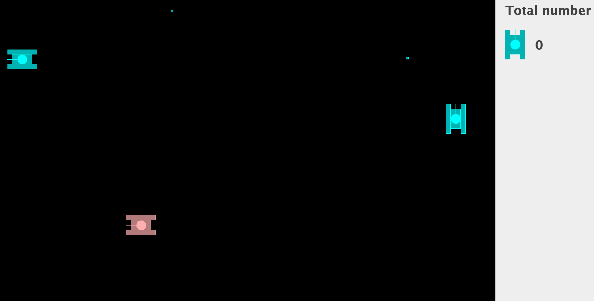

# TankGameV3
This project entails the creation of an engaging tank game using Java, featuring tanks from different camps engaging in strategic battles. The game is developed with a strong emphasis on object-oriented programming (OOP) principles, showcasing my ability to apply these concepts in a real-world application.

# Camp
> Pink color tank for user
> Blue color tanks for enemies

# Highlight
> User can set the speed of tanks, bullet movement.
> When the tanks were shooted, the effect of the explosion would appear.
> User can use the W, A, S, D, and J keys on the keyboard to control the movement of the tank and shoot. 

